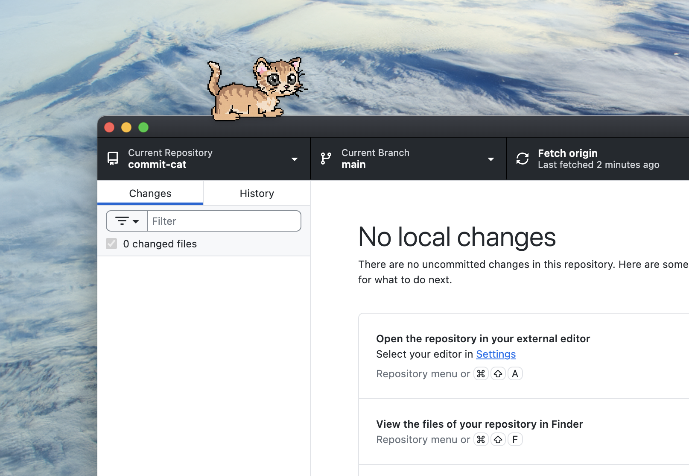

# CommitCat 🐈‍⬛

A developer desktop companion that grows with your coding activity.



CommitCat lives on your desktop, watches your development environment locally, and reacts to your work — commits, coding time, focus sessions, and more.

> 🐱 A tiny coding partner that never judges you (even at 3 AM).

---

## ✨ Features

### Core
- 🐾 Desktop pet with pixel-art sprites — walks, sits, sleeps, and celebrates
- 👣 Menu bar / system tray companion (streak tooltip)
- 🖱️ Draggable — place it anywhere on your screen
- 🖱️ Click-through — transparent areas pass clicks to the desktop
- 💬 Click to chat (speech bubble reactions with personality)
- 💬 Random coding messages — cat reacts while you code
- 🎨 Multi-color cat (orange / brown / white)
- 🐾 Petting — right-click & swipe to pet the cat with tiered reactions
- 💤 Sleeps when you're away
- 🖥️ Fullscreen-aware — auto-hides when you go fullscreen

### Coding Activity
- 🐙 Local Git commit & push tracking — reacts every time you commit
- 💻 IDE detection — knows when you're coding (VS Code, JetBrains, Xcode, and more)
- 🌙 Late-night coding awareness
- 🌱 XP & level system — grows with your activity
- 🔥 Streak system — 3/7/30-day milestones with bonus XP
- ✨ Pixel-art level-up animation with burst particles

### Focus & Productivity
- ⏱️ Pomodoro focus timer with break timer
- 📊 Daily summary timeline (right-click → Today) — view commits, coding time, XP earned, and event history

### Integrations
- 🐙 GitHub integration — PR open/merge XP, star notifications
- 🤖 Claude AI chat — double-click the cat to chat with your AI companion (Anthropic API)
- 🧩 VSCode Extension — install from the [VSCode Marketplace](https://marketplace.visualstudio.com/items?itemName=commitcat.commitcat) for seamless IDE detection
- 🔔 macOS Notification Center — system notifications for key events
- 🔄 Auto-update checker — notifies when a new version is available

### IDE Plugins
- 📦 [VS Code Extension](https://marketplace.visualstudio.com/items?itemName=commitcat.commitcat) — coding time, file saves, build tracking
- 📦 JetBrains Plugin (IntelliJ, WebStorm, PyCharm, GoLand, CLion, RustRover) — coding time, file saves, build tracking

### Settings
- ⚙️ Settings panel — manage watched repos, cat color, timer durations, API keys, and XP progress
- 🐳 Docker activity awareness — container start/build detection with XP

---

## 🧠 How It Grows

CommitCat gains XP from:

| Activity | XP |
|---|---|
| Git commit | +10 XP |
| Git push | +5 XP |
| 1 hour of coding | +5 XP |
| Late-night session | +15 XP |
| Pomodoro complete | +20 XP |
| GitHub PR opened | +20 XP |
| GitHub PR merged | +30 XP |
| Docker container start | +5 XP |
| Docker build complete | +15 XP |
| 3-day streak | +50 XP |
| 7-day streak | +100 XP |
| 30-day streak | +500 XP |

Level up formula: **Level n → n+1 requires n × 100 XP**

The more you build, the happier it becomes.

---

## 🔒 Privacy First

CommitCat is designed for developers who care about privacy.

- ❌ No code is collected
- ❌ No keystrokes are recorded
- ❌ No files are uploaded
- ❌ No telemetry by default

✔️ All data is stored locally on your machine
✔️ External integrations (GitHub, AI) are opt-in only

---

## 🖥️ Platforms

- ✅ macOS
- ✅ Windows
- ✅ Linux

---

## 📦 Installation

Download from the [Releases page](https://github.com/eunseo9311/commit-cat/releases).

**macOS**
```
CommitCat.dmg
```

> **macOS Gatekeeper 경고 시:**
> 앱이 코드사인되지 않아 "손상되었기 때문에 열 수 없습니다" 경고가 나올 수 있습니다.
> 터미널에서 아래 명령어를 실행하면 해결됩니다:
> ```
> xattr -cr /Applications/Commit\ Cat.app
> ```

**Windows**
```
CommitCat-Setup.exe
```

**Linux**
```
CommitCat.AppImage   # Most distros
CommitCat.deb        # Debian/Ubuntu
```

> **Wayland (Hyprland, Sway 등) 사용 시 EGL 에러가 발생하면:**
> ```
> WEBKIT_DISABLE_DMABUF_RENDERER=1 commit-cat
> ```
> 또는 X11 백엔드를 사용하세요:
> ```
> GDK_BACKEND=x11 commit-cat
> ```

### VSCode Extension
Search **"CommitCat"** in the VSCode Extensions tab, or install directly from the [Marketplace](https://marketplace.visualstudio.com/items?itemName=commitcat.commitcat).

### Build from source

```bash
git clone https://github.com/eunseo9311/commit-cat.git
cd commit-cat
npm install
npm run tauri dev
```

**Requirements:** Node.js, Rust, Tauri CLI

---

## 🛠️ Built With

- [Tauri](https://tauri.app/) — lightweight desktop framework
- [React](https://react.dev/) — UI
- [Rust](https://www.rust-lang.org/) — system integration, Git & IDE tracking
- [Anthropic API](https://docs.anthropic.com/) — AI chat (optional)

---

## 🗺️ Roadmap

**MVP ✅**
- [x] Desktop pet rendering
- [x] Activity & IDE detection
- [x] Local Git integration
- [x] XP & growth system
- [x] Tray / menu bar UI
- [x] Settings panel

**v1.0 — Local Complete ✅**
- [x] Pomodoro focus timer with break timer
- [x] Daily coding summary & event timeline
- [x] GitHub integration (PR tracking, star notifications)
- [x] Claude AI chat companion
- [x] macOS / Windows / Linux support
- [x] Docker integration
- [x] IDE plugins (VS Code Extension, JetBrains Plugin)
- [x] Petting interaction & click-through

**v1.1 — Architecture Refactor ✅**
- [x] Cargo workspace + `commit-cat-core` crate extraction
- [x] Platform trait abstraction (`#[cfg]` cleanup)
- [x] Remove duplicated model files in `src-tauri`
- [x] State machine integration (core as single source of truth)

**v1.2 — Design & Items (in progress) 🎨**
- [x] Item system foundation (hats, accessories, inventory UI)
- [x] Grab sprite system (color-specific drag animations)
- [x] AI provider/model selection (Claude + OpenAI GPT)
- [x] JetBrains plugin marketplace preparation
- [x] Cat design renewal
- [ ] Auto-equip items (birthday hat, commit streak crown, etc.)
- [ ] JetBrains Extension marketplace release

**v1.3 — VSCode Webview 🖥️**
- [ ] Cat rendering inside VSCode (Webview Panel)
- [ ] Environment detection (desktop / Codespaces / web)

**v2.0 — Cloud ☁️**
- [ ] Cloud API server (Rust + Axum)
- [ ] Cross-device sync (event-based, offline-first)
- [ ] GitHub OAuth

**v2.1 — Badge & Profile 🏅**
- [ ] GitHub README badge (``)
- [ ] Public profile page
- [ ] GitHub Codespaces support

**v3.0 — Multi-Platform 🌐**
- [ ] Discord bot integration
- [ ] External app widgets
- [ ] Community features (leaderboard, team stats)

---

## 🤝 Contributing

Contributions are welcome!

- Open an issue
- Suggest features
- Submit pull requests

---

## 📜 License

MIT License

---

## 💬 Status

v1.2 in progress — item system & design renewal
If you like the idea, consider giving the repo a ⭐
